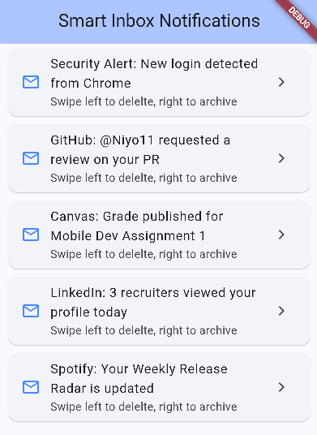

# Flutter Dismissible Widget Presentation

A polished live-demo application showcasing real-world swipe to dismiss functionality in Flutter.

## Widget Description
The `Dismissible` widget allows users to seamlessly dismiss list items or interactive tiles by swiping them horizontally or vertically off the screen.

## How to Run the Project
1. Ensure you have the Flutter SDK installed on your machine.
2. Clone this repository: 
   ```bash
   git clone https://github.com/ydejene/flutter-dismissible-demo.git
   ```
3. Navigate into the project directory:
   ```bash
   cd flutter-dismissible-demo
   ```
4. Fetch dependencies:
   ```bash
   flutter pub get
   ```
5. Run the application on an emulator or connected device:
   ```bash
   flutter run
   ```

## The 3 Demonstrated Attributes
During the live presentation, the following three constructor properties are showcased and altered to prove production utility:

1. **`background`**
   - **What it does:** Defines the row (a green container with an archive icon and text) revealed when swiping from left to right.
   - **Why developers use it:** Provides the user with instant visual confirmation of the primary action they are performing.

2. **`secondaryBackground`**
   - **What it does:** Specifies a secondary layout (a red container with a delete icon and text) revealed only when swiping from right to left.
   - **Why developers use it:** Enables a single list tile to host two distinctly separate actions depending on swipe direction (like Gmail).

3. **`confirmDismiss`**
   - **What it does:** Accepts a function that returns a boolean future, intercepting the swipe and letting the developer prompt the user before the row disappears.
   - **Why developers use it:** Acts as a safety net by triggering an explicit AlertDialog barrier confirming the exact notification title to protect users from accidental data loss.

## Final UI Screenshot


---
*Disclaimer: This project was built for an educational presentation. External learning resources from the official Flutter Documentation cookbook were referenced to ensure production-level layout practices.*

